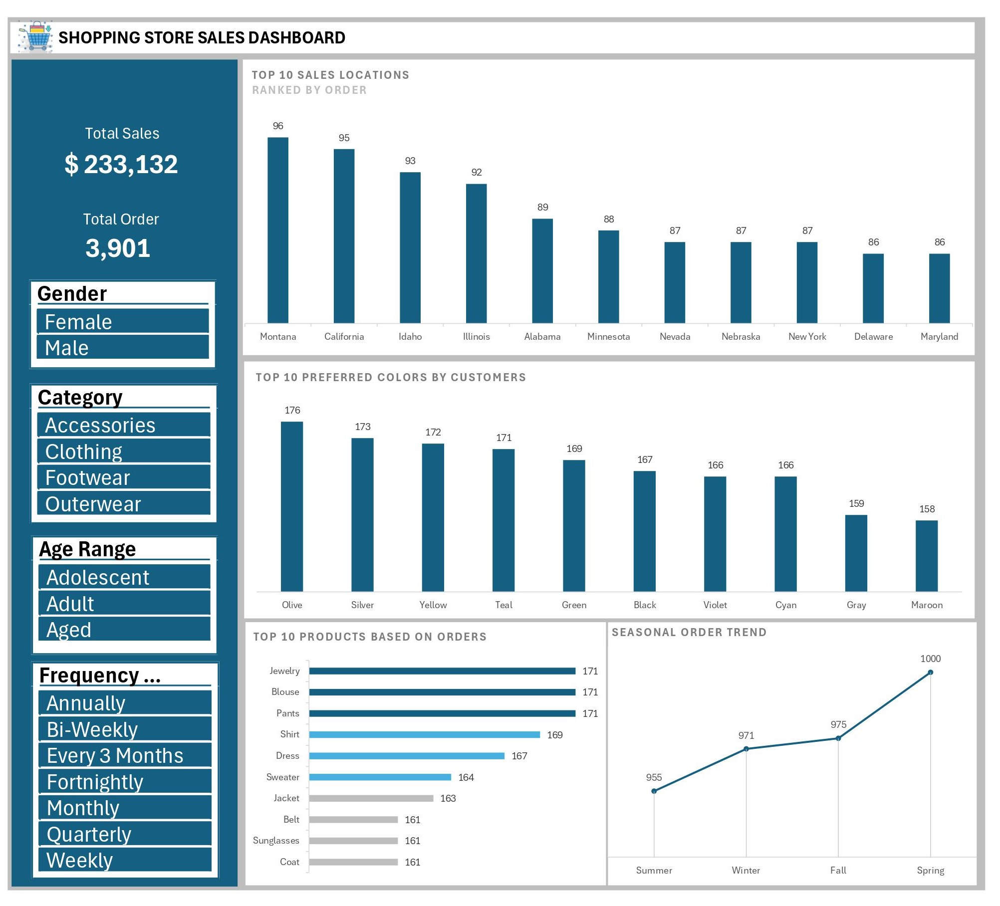

# Shopping Store Sales Analysis

#### Table of Contents
- [Introduction](https://github.com/KingYungzel/Shopping-Store-Sales##Introduction)

---

## Introduction
This is a Microsoft Excel project on sales analysis of an imaginary store called **Shopping Store Sales**.
The goal of this project is to dig deep into sales data to uncover valuable insights by examining product performance, customer preferences in color, and seasonal trends. 
We strive to identify trends, provide data-driven recommendations, and develop a comprehension of the business performance.

## Problem Statement 
The marketing department is planning to launch a campaign in the second quarter of 2024. However, they need a dashboard to monitor business activity while awaiting the campaign launch. This dashboard will offer insights into where to focus the campaign efforts effectively. The marketing lead requires tracking various metrics over time, including product performance, changes in customers' color preferences, location, and seasonal patterns in relation to orders. Additionally, any other relevant metric(s) should be incorporated into the dashboard to provide comprehensive insights for informed decision-making.

## Data Source
The main dataset utilized for this project is the **_project.xlsx_** file, which provides detailed insights into every transaction carried out by the company.

## Tools
Microsoft Excel was the tool used for this project based on Principles below:
- Data Cleaning
- Data Analysis
- Report Creation

## Data Cleaning
- Removing duplicate entries.
- Correcting misspellings or inconsistencies in data.
- Handling missing or incomplete data by filling in as N/A.
- Identifying and removing outliers.
- Applying filters to identify and correct data irregularities.

## Data Analysis
- Pivot Tables

## Exploratory Data Analysis (EDA)
**What is Exploratory Data Analysis (EDA)?** Exploratory Data Analysis (EDA) is an approach to analyzing datasets to summarize their main characteristics , often using visual methods.

**EDA requires examining the sales data to provide solutions to the key questions, such as:**
- Top 10 Sales Locations ranked by Order.
- Top 10 Customer-Preferred Colors
- Top 10 products ranked by the number of orders received
- Seasonal Ordering Trends

You can interact with the report [here](https://5w0m4q-my.sharepoint.com/:x:/g/personal/yungzel_yungzelgraphic_name_ng/EYUkn-3m_5dLqs-ACAKAy88BLiUtt60t2hqlz4-pQUiPuQ?e=QZmipn&nav=MTVfezQwNDQ2OTZFLURERjYtNDk3Mi04QjM5LTE5QUFBN0E2ODAyN30) 🤓

## Results
**The results of the analysis are summarized below:**
- The state of Montana witnessed the highest volume of orders.
- Customers' top choice for color in their orders is Olive. 
- The three most frequently ordered products are Jewelry, Blouse, and Pants, ranking in the top positions based on order frequency.
- Most orders are placed during the spring season.

## Recommendations
- Given that Montana has the highest volume of orders, consider focusing a significant portion of the campaign efforts in this region
- Since Olive is the preferred color choice among customers, feature products available in this color
- Jewelry, Blouse, and Pants are the top-selling products, these products should be prioritized in marketing campaigns
- Since most orders are placed during the spring season, the campaign should be launched in Spring Season
- Additionally, it's important to focus on Adolescents since the analysis indicates a low number of orders from this demographic.

## Limitations 
During the analysis, incomplete data or blank spaces were identified and represented as **"N/A"**. These missing or incomplete entries might limit the accuracy of the project's findings.

## Appreciation
Thank you for taking the time to explore my project on GitHub. Your interest and engagement mean a lot to me.

